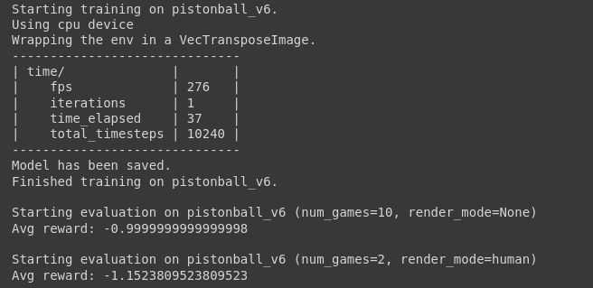

The first problem we have to deal with is that the environment’s observations are full color images. We don’t need the color information and it’s 3x more computationally expensive for the neural networks to process than grayscale images due to the 3 color channels.

env = ss.color_reduction_v0(env, mode=’B’)

Note that the B flag actually takes the Blue channel of the image instead of turning all the channels into grayscale to save processing time as this will be done hundreds of thousands of times during training.

Let’s shrink them down; 84x84 is a popular size for this in reinforcement learning because it was used in a famous paper by DeepMind.

env = ss.resize_v0(env, x_size=84, y_size=84)

The simplest way to do that is to stack the past few frames together as the channels of each observation. Stacking 3 together gives enough information to compute acceleration, but 4 is more standard.

env = ss.frame_stack_v1(env, 3)

Next, we need to convert the environments API a tiny bit, which will cause Stable Baselines to do parameter sharing of the policy network on a multiagent environment (instead of learning a single-agent environment like normal).

env = ss.pettingzoo_env_to_vec_env_v1(env)

Finally, we need to set the environment to run multiple versions of itself in parallel. Playing through the environment multiple times at once makes learning faster and is important to PPOs learning performance.

env = ss.concat_vec_envs_v1(env, 8, num_cpus=4, base_class=’stable_baselines3’)

8 refers to the number of times we’re duplicating the environment, and num_cpus is the number of CPU cores these will be run on. These are hyperparameters and you’re free to play around with these. In our experience running more than 2 environments per thread can get problematically slow, so keep that in mind.

## Piston Environment 

